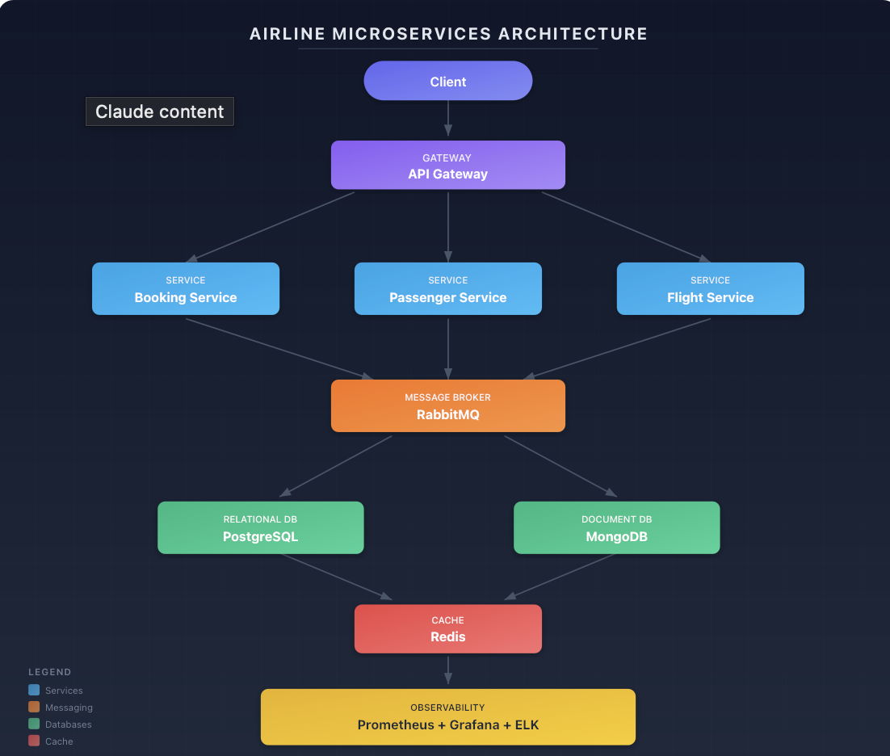

# Distributed Booking Platform

A production-style microservices platform built using Java and Spring Boot demonstrating event-driven architecture, observability, and containerized infrastructure.

## Architecture

## Tech Stack

Backend
- Java
- Spring Boot
- Microservices

Messaging
- RabbitMQ

Databases
- PostgreSQL
- MongoDB

Caching
- Redis

Observability
- Prometheus
- Grafana
- Elasticsearch
- Kibana
- Zipkin

Infrastructure
- Docker
- Docker Compose

## Features

- Event-driven communication
- Distributed tracing
- Metrics monitoring
- Centralized logging
- Microservice architecture

## Running the Infrastructure

docker compose -f docker-compose.infrastructure.yaml up -d